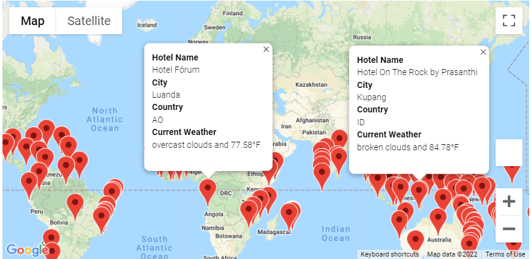
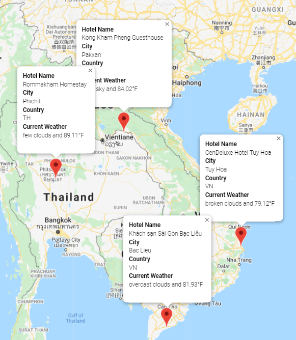
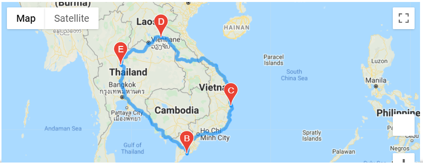

# World_Weather_Analysis

## Overview of the Challenge
PlanMyTrip is collecting customer data to survey their vacation preferences so as to provide better hotel choices. After showing various relationships between latitude and (max temp, humidity, cloudiness, and wind speed), it is time to create a beta app to help narrow customers' hotel choices down. The goal is to retrieve destinations, hotels nearby, and the weather condition for customers based on their minimum and maximum temperature thresholds. Lastly, create a potential itinerary with directions between cities for customers. 

## Results
Customer John Doe has entered in the criteria 75 and 90 for his minimum and maximum temperature threshold on the Beta app from PlanMyTrip. The search criteria has returned possible city destination with weather and hotel information for his convenient. The result is shown below.

John has decided to travel around Southeast Asia and would like to visit four cities. His choices are below.

The app was able to calculate possible routes John could take between his four destinations. An example is shown below.

## Summary
Customer John Doe was very happy with the information he had gotten from the Beta app. He is now a loyal customer to PlanMyTrip and will use their platform for future travels. It is safe to say that this app does what John was looking for. John also recommends adding average hotel pricing for future updates on the app. PlanMyTrip likes that idea and is looking into that possibility. 
